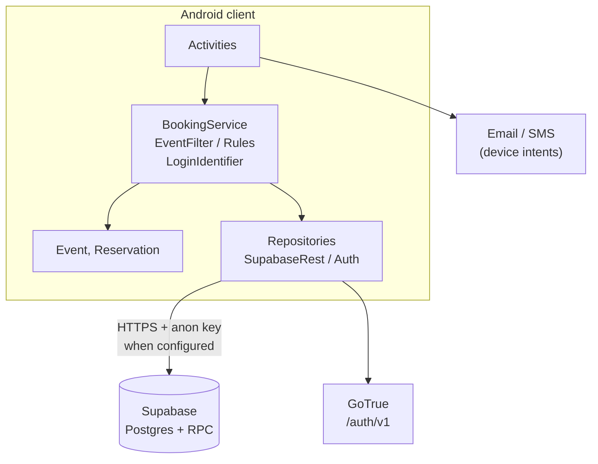
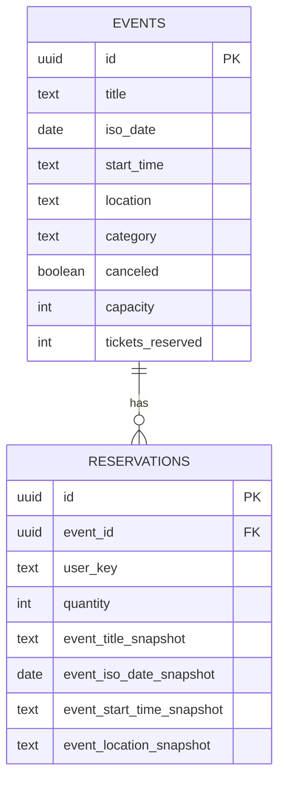
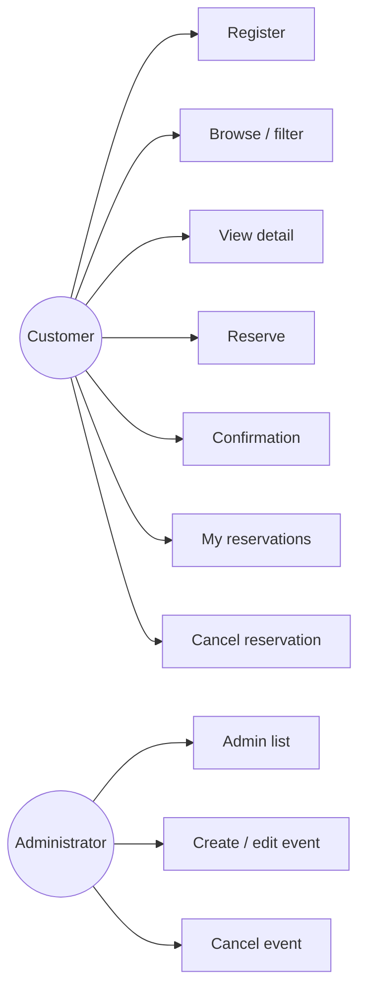
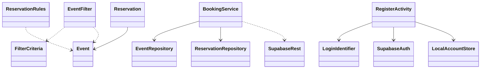
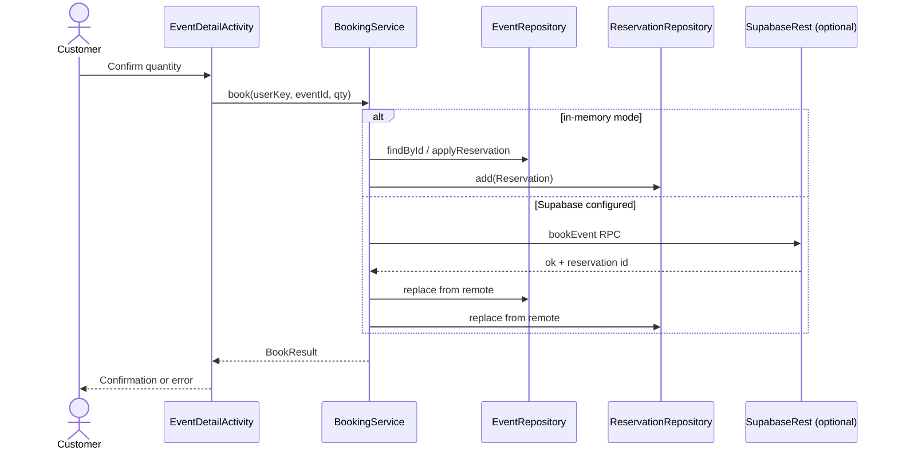
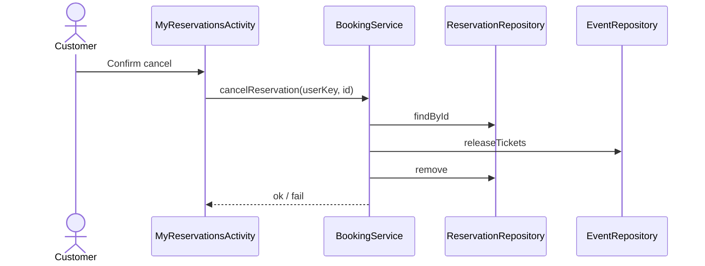
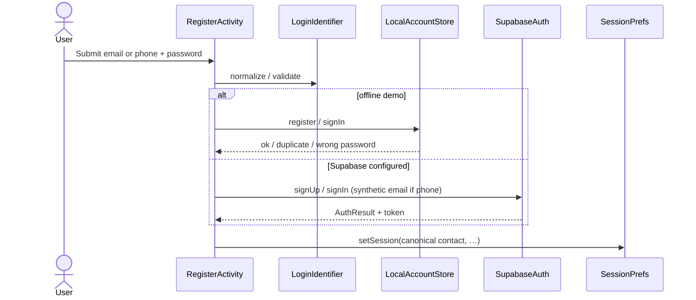
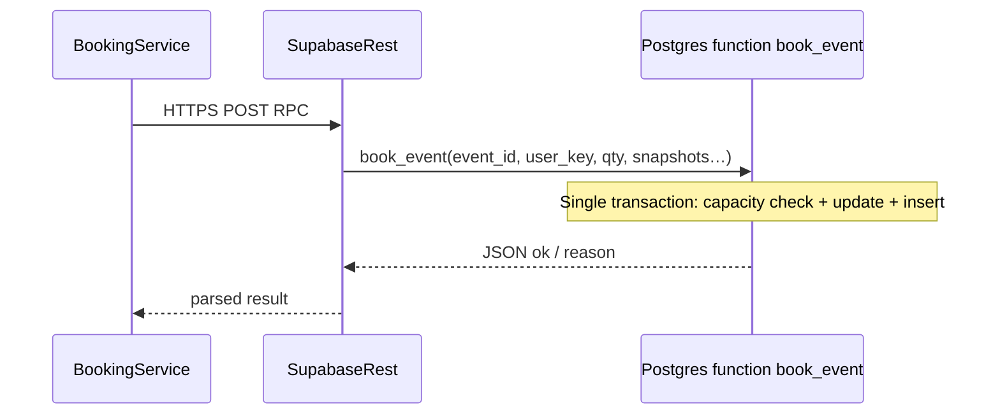

# Ticket Reservation — design specification (living document)

## Where this lives on GitHub

This file is in the repository at **`docs/DESIGN.md`**. On GitHub you will see it under **Code → `docs` → `DESIGN.md`**, or open:

`https://github.com/<your-username>/SOEN345-TicketReservation/blob/main/docs/DESIGN.md`

(Replace `<your-username>` with your org or user name.)

Keeping design docs **in the repo** (not only in the Wiki) means they **version with commits**, show up in **pull requests**, and stay aligned with **continuous integration**: every merge to `main` can still run [`.github/workflows/ci.yml`](../.github/workflows/ci.yml) while the product evolves.

---

## Project status (read this first)

| Topic | Status |
|--------|--------|
| **Delivery model** | **Iterative.** Git + PRs + CI; design and migrations version with code. |
| **Persistence** | **Supabase (Postgres + RPC)** when `local.properties` supplies `supabase.url` and `supabase.anon.key`; otherwise **in-memory** repositories (local dev without keys, fast JVM tests, CI build job without cloud secrets). |
| **Identity** | **Supabase Auth** (email/password) when configured; **offline** accounts via `LocalAccountStore` (SHA-256 salted hash). Registration accepts **email or phone** (phone normalized to E.164-style `+`digits; Supabase uses a stable synthetic email alias for password grant only). Session `user_key` = canonical contact (email or `+`phone). |
| **Catalog / bookings** | `EventRepository` / `ReservationRepository` sync from PostgREST; `BookingService` uses **`book_event` / `cancel_reservation` RPCs** for atomic inventory when remote; in-memory path uses the same business rules. |
| **Notifications (customer)** | **Email** and **SMS** use device intents (`ReservationConfirmationActivity`) — no in-app SMTP or carrier API (explicit non-functional boundary: user completes send). |

Schema and RPCs are defined under **`supabase/migrations/`**; update this document when migrations change.

---

## 1. Use cases — actors

| Actor | Role |
|--------|------|
| **Customer** | Register, browse/filter, detail, reserve, confirmation, list/cancel own reservations. |
| **Administrator** | List events, create/edit, cancel events. |
| **System** *(optional)* | Validation, persistence, notifications, concurrency. |

### Use case summary (detailed narratives belong in the course report if required)

| ID | Name | Goal (short) |
|----|------|----------------|
| UC-01 | Register | Store email/phone identity for booking. |
| UC-02 | Browse / filter events | Find events by text, date, location, category. |
| UC-03 | View event detail | Show availability and metadata before booking. |
| UC-04 | Reserve tickets | Create reservation; reduce inventory atomically. |
| UC-05 | View confirmation | Show summary after successful reserve. |
| UC-06 | List / cancel reservations | Manage own bookings; restore inventory on cancel. |
| UC-07 | Admin — list events | Full catalog for management. |
| UC-08 | Admin — create / edit event | Maintain catalog fields and capacity. |
| UC-09 | Admin — cancel event | Mark event canceled; block new sales (policy for existing reservations as per report). |

**Typical alternates (all use cases):** validation errors, empty catalog, sold out, event canceled, not registered, network/server failure (target system), concurrent last-ticket race.

---

## 2. Architecture

### 2.1 Layers (logical)

The **presentation** layer (Activities) handles UI and navigation. The **application** layer (`BookingService`, `EventFilter`, `FilterCriteria`, `ReservationRules`, `LoginIdentifier`) encodes use-case rules. The **domain** holds `Event` and `Reservation`. The **data** layer (`EventRepository`, `ReservationRepository`, `SupabaseRest`, `SupabaseAuth`, `LocalAccountStore`) abstracts remote vs in-memory storage.

**CI** runs **unit** tests on the JVM and **instrumented** Espresso tests on an emulator on every push/PR to `main` / `develop` (see [`.github/workflows/ci.yml`](../.github/workflows/ci.yml)).

### 2.2 Deployment (implemented + boundaries)

**Browse / filter:** UI → `EventRepository` (memory or REST) → `EventFilter` → list.

**Reserve:** UI → `BookingService` → in-memory `applyReservation` **or** `SupabaseRest.bookEvent` RPC (single transaction: `UPDATE events` + `INSERT reservations`).

**Cancel:** `BookingService` → memory **or** `cancel_reservation` RPC (validates `user_key`, restores inventory).

### 2.3 Functional requirements — traceability (Excellent / marking aid)

| ID | Requirement | Primary implementation | Automated tests (examples) |
|----|----------------|-------------------------|---------------------------|
| FR-01 | Register with **email or phone** | `RegisterActivity`, `LoginIdentifier`, `LocalAccountStore` / `SupabaseAuth` | `LoginIdentifierTest`, `MainFlowInstrumentedTest`, `LocalAccountStoreInstrumentedTest` |
| FR-02 | Browse & **search/filter** events | `MainActivity`, `EventFilter`, `FilterCriteria` | `EventFilterTest`, Espresso search empty state |
| FR-03 | View event **detail** & availability | `EventDetailActivity`, `ReservationRules` | `MainFlowInstrumentedTest`, `ReservationRulesTest` |
| FR-04 | **Reserve** tickets | `BookingService`, RPC `book_event` | `BookingServiceTest`, `BookingSingletonIntegrationTest`, instrumented singleton test |
| FR-05 | **Confirmation** (+ share) | `ReservationConfirmationActivity` | Manual / UI smoke; email & SMS intents |
| FR-06 | **List / cancel** own reservations | `MyReservationsActivity`, `BookingService.cancelReservation` | `BookingServiceTest`, `AdminAndUserBookingInstrumentedTest` |
| FR-07–09 | **Admin** catalog CRUD / cancel flag | `AdminActivity`, `AdminEventEditActivity` | `AdminAndUserBookingInstrumentedTest`, repository tests |

### 2.4 Non-functional requirements — evidence

| NFR | Intent | How the project addresses it |
|-----|--------|-------------------------------|
| **Cloud-backed** | Data off-device when configured | Supabase Postgres + PostgREST; no secrets in repo (`local.properties`). |
| **Availability** | Honest dependency on provider + network | Timeouts on HTTP; in-memory fallback for demos without keys; report should state single-region / no SLA claim. |
| **Concurrent / consistent booking** | No oversell under contention | `book_event` RPC: single `UPDATE … WHERE capacity` then insert; mirrored rules in `ReservationRules` + `Event.applyReservation` for local mode. |
| **Security (auth & session)** | Protect credentials; isolate users | Passwords hashed offline (`LocalAccountStore`); Supabase tokens in `SessionPrefs`; **wrong user cannot cancel** (`BookingServiceTest`); `SessionPrefsInstrumentedTest`. |
| **Performance (responsiveness)** | UI stays usable | `EventFilterPerformanceTest` (large catalog filter budget). |
| **Usability** | Simple Material UI + validation | Espresso main/register/detail flows; `RegisterValidationInstrumentedTest`. |
| **Maintainability / quality** | Regression safety | Layered tests + CI on every PR; design versioned in repo. |

---

## 3. Database design (implemented — Supabase / Postgres)

**Source of truth:** SQL under `supabase/migrations/` (apply in timestamp order). Identity for reservations is the app’s **`user_key`** (email or normalized phone string), not a local `users` table — **Supabase Auth** holds auth users separately when cloud sign-in is used.

### 3.1 Physical tables (summary)

| Table | Key columns | Purpose |
|--------|-------------|---------|
| **events** | `id`, `title`, `iso_date`, `start_time`, `location`, `category`, `canceled`, `capacity`, `tickets_reserved` | Catalog + live inventory counters. |
| **reservations** | `id`, `event_id`, `user_key`, `quantity`, snapshot columns (`event_title_snapshot`, …) | One row per booking; snapshots preserve confirmation text if event edits later. |

**RPCs:** `book_event(...)`, `cancel_reservation(...)` — `SECURITY DEFINER`, granted to `anon` / `authenticated` per migration (tighten for production beyond course scope).

### 3.2 ER diagram (as deployed)

### 3.3 Logical evolution (optional future work)

A dedicated **`users`** table and admin `role` column could replace anonymous `user_key` strings and support stricter RLS (customer vs organizer). That is **not** required for the current rubric demo.

---

## 4. UML (Mermaid)

### 4.1 Use case diagram (simplified)

### 4.2 Class diagram (domain + application + data touchpoints)

### 4.3 Sequence — reserve tickets

### 4.4 Sequence — cancel reservation

### 4.5 Sequence — register / sign-in (dual mode)

### 4.6 Sequence — cloud booking (atomic RPC)

---

## 5. Assumptions & explicit boundaries

- **Reservations** reduce **available quantity** against each event’s **capacity**; inventory and user holds stay consistent in the local store and optional Supabase path.  
- **Transactional email/SMS** (server-sent, queued) is **out of scope**; the app opens the user’s **email or SMS app** with a prefilled draft (`ReservationConfirmationActivity`) — suitable for coursework evidence of “confirmation channel” without operating an MTA.  
- **RLS policies** in migrations are permissive for the course demo; production would narrow `anon` vs `authenticated` and tie `user_key` to JWT claims.  
- **CI** should stay green on `main` / `develop`; teams should use **PR reviews** (see [`.github/pull_request_template.md`](../.github/pull_request_template.md)).

---

## Related docs

- [REPORT_TESTING_AND_CI.md](REPORT_TESTING_AND_CI.md) — testing evidence for the report.  
- [../TESTING.md](../TESTING.md) — how to run tests locally and in CI.  
- [TESTING_AUDIT.md](TESTING_AUDIT.md) — test keep/delete decisions, P0–P3 roadmap, CI notes, gaps.
