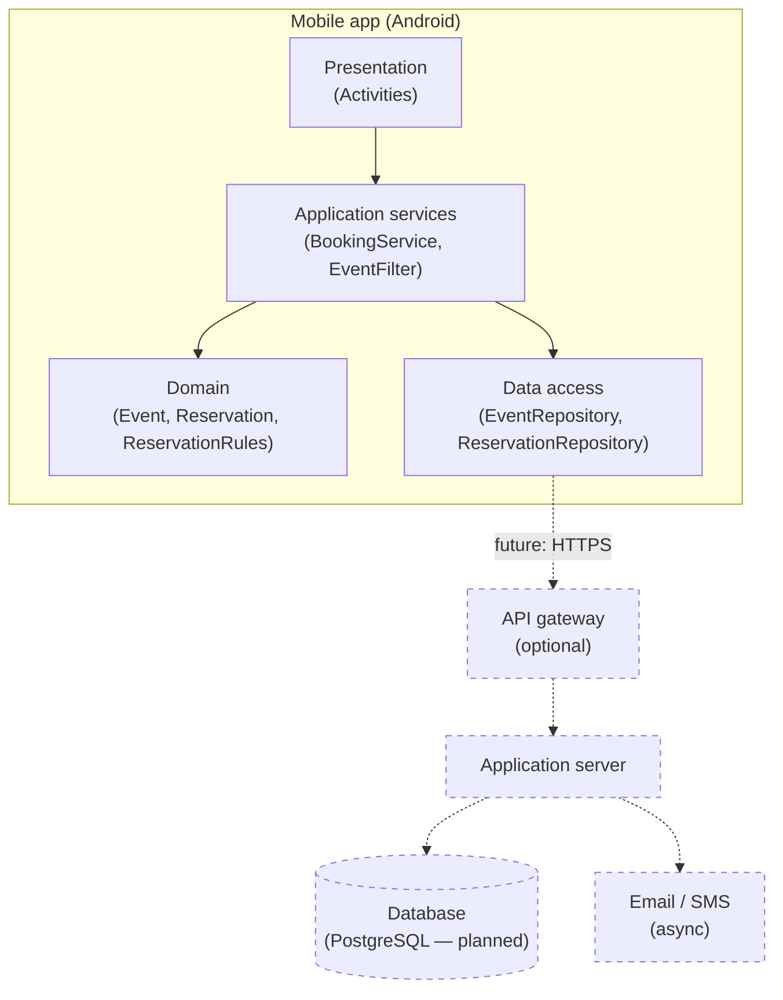
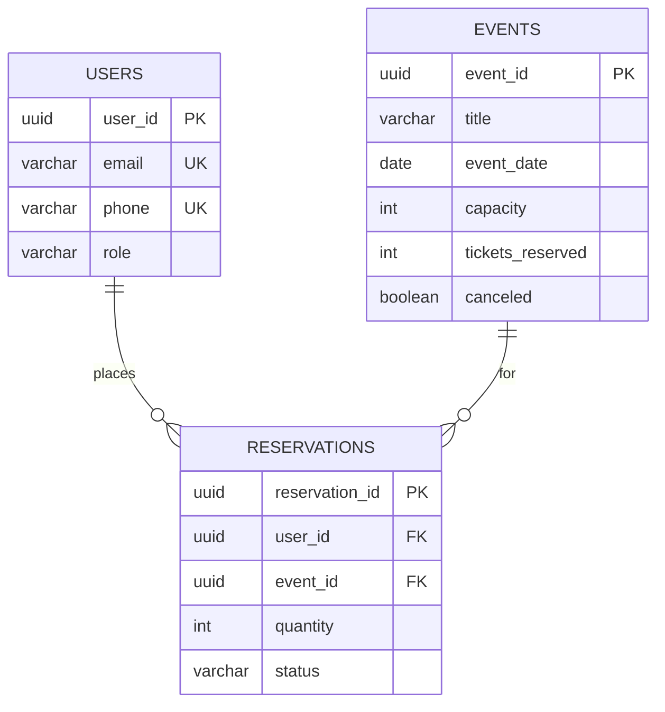
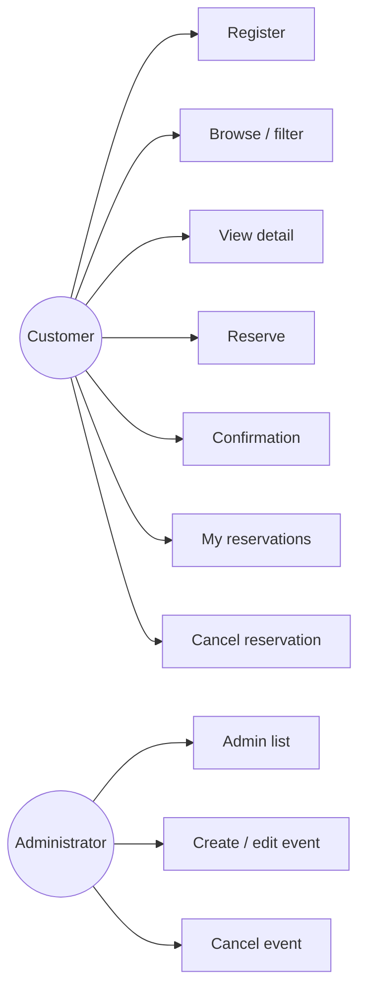
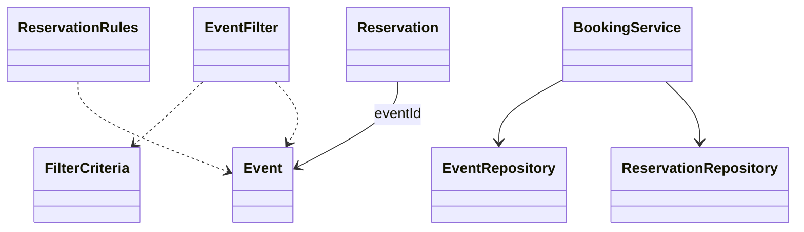
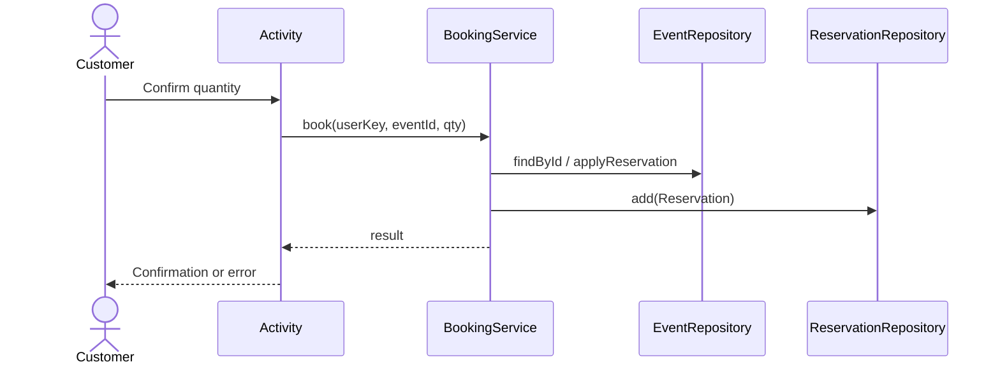
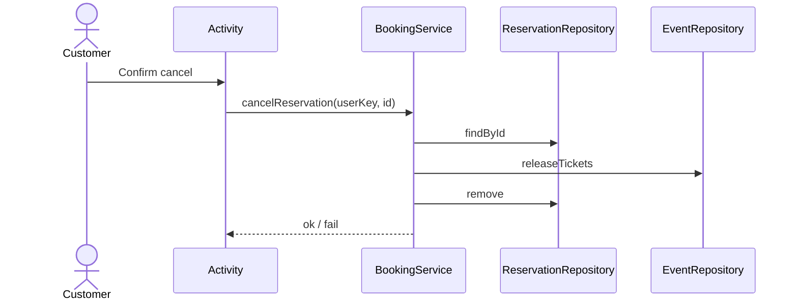

# Ticket Reservation — design specification (living document)

## Where this lives on GitHub

This file is in the repository at **`docs/DESIGN.md`**. On GitHub you will see it under **Code → `docs` → `DESIGN.md`**, or open:

`https://github.com/<your-username>/SOEN345-TicketReservation/blob/main/docs/DESIGN.md`

(Replace `<your-username>` with your org or user name.)

Keeping design docs **in the repo** (not only in the Wiki) means they **version with commits**, show up in **pull requests**, and stay aligned with **continuous integration**: every merge to `main` can still run [`.github/workflows/ci.yml`](../.github/workflows/ci.yml) while the product evolves.

---

## Project status (read this first)

| Topic | Status |
|--------|--------|
| **Delivery model** | **Iterative.** The app is integrated continuously via Git and CI; this document is **not** a frozen “final product” spec. |
| **Persistence today** | **Supabase (Postgres)** when `local.properties` defines `supabase.url` + `supabase.anon.key`; otherwise **in-memory** repositories for tests/CI. **Session** user key in `SharedPreferences`. |
| **Database** | **Implemented:** app talks to Supabase via PostgREST; `supabase/migrations/` defines schema + RPCs. Sections below remain the logical/ER view for documentation. |
| **Cloud / API** | **Target architecture** only; wiring to a live backend may follow the DB milestone. |

When the database layer is added, update this file (and diagrams if table names change) in the **same PR** as the implementation so design and code stay traceable.

---

## 1. Use cases — actors

| Actor | Role |
|--------|------|
| **Customer** | Register, browse/filter, detail, reserve, confirmation, list/cancel own reservations. |
| **Administrator** | List events, create/edit, cancel events. |
| **System** *(optional)* | Validation, persistence, notifications, concurrency. |

### Use case summary (detailed narratives belong in the course report if required)

| ID | Name | Goal (short) |
|----|------|----------------|
| UC-01 | Register | Store email/phone identity for booking. |
| UC-02 | Browse / filter events | Find events by text, date, location, category. |
| UC-03 | View event detail | Show availability and metadata before booking. |
| UC-04 | Reserve tickets | Create reservation; reduce inventory atomically. |
| UC-05 | View confirmation | Show summary after successful reserve. |
| UC-06 | List / cancel reservations | Manage own bookings; restore inventory on cancel. |
| UC-07 | Admin — list events | Full catalog for management. |
| UC-08 | Admin — create / edit event | Maintain catalog fields and capacity. |
| UC-09 | Admin — cancel event | Mark event canceled; block new sales (policy for existing reservations as per report). |

**Typical alternates (all use cases):** validation errors, empty catalog, sold out, event canceled, not registered, network/server failure (target system), concurrent last-ticket race.

---

## 2. Architecture

### 2.1 Layers (logical)

The **presentation** layer (Android Activities) handles UI and navigation. The **application** layer (`BookingService`, `EventFilter` / `FilterCriteria`, `ReservationRules`) orchestrates use cases without owning storage details. The **domain** holds `Event` and `Reservation`. The **data access** layer (`EventRepository`, `ReservationRepository`) abstracts storage: **in-memory today**, **API + DB** in the target system.

Continuous integration validates that refactors to these layers still pass **unit** and **instrumented** tests as the codebase grows.

### 2.2 Target deployment (Mermaid)



**List events (target):** UI → repository client → API → DB → response → filtered list.

**Place reservation (target):** UI → `BookingService` → transactional API → DB update (event inventory + reservation row) → optional notification job.

---

## 3. Database design (target — not yet in app code)

### 3.1 Tables (logical)

| Table | PK | Purpose |
|--------|-----|---------|
| **users** | `user_id` | Customers and admins (`role`); optional `email` / `phone` uniqueness. |
| **events** | `event_id` | Catalog: title, date, location, category, capacity, `tickets_reserved`, `canceled`. |
| **reservations** | `reservation_id` | Links `user_id` + `event_id`, `quantity`, `status` (e.g. ACTIVE/CANCELED). |

### 3.2 ER diagram (Mermaid)



### 3.3 Example SQL (PostgreSQL-style — implementation TBD)

```sql
CREATE TABLE users (
  user_id    UUID PRIMARY KEY DEFAULT gen_random_uuid(),
  email      VARCHAR(320) UNIQUE,
  phone      VARCHAR(32) UNIQUE,
  role       VARCHAR(16) NOT NULL CHECK (role IN ('CUSTOMER', 'ADMIN')),
  created_at TIMESTAMPTZ NOT NULL DEFAULT now()
);

CREATE TABLE events (
  event_id         UUID PRIMARY KEY DEFAULT gen_random_uuid(),
  title            VARCHAR(500) NOT NULL,
  event_date       DATE NOT NULL,
  location         VARCHAR(500) NOT NULL,
  category         VARCHAR(100) NOT NULL,
  capacity         INT NOT NULL CHECK (capacity >= 0),
  tickets_reserved INT NOT NULL DEFAULT 0,
  canceled         BOOLEAN NOT NULL DEFAULT false
);

CREATE TABLE reservations (
  reservation_id UUID PRIMARY KEY DEFAULT gen_random_uuid(),
  user_id        UUID NOT NULL REFERENCES users (user_id),
  event_id       UUID NOT NULL REFERENCES events (event_id),
  quantity       INT NOT NULL CHECK (quantity > 0),
  status         VARCHAR(16) NOT NULL DEFAULT 'ACTIVE'
);
```

---

## 4. UML (Mermaid)

### 4.1 Use case diagram (simplified)



### 4.2 Class diagram (domain + services)



### 4.3 Sequence — reserve tickets



### 4.4 Sequence — cancel reservation



---

## 5. Assumptions

- Single currency; **no payment gateway** in current scope unless the course adds it.  
- **CI** runs on each push/PR; failing tests block merges as team policy.  
- **DB implementation** will align with this document; schema may gain audit columns (`created_at`, `updated_at`) when implemented.  
- Email/SMS are **async** relative to the core reserve transaction in the target system.

---

## Related docs

- [REPORT_TESTING_AND_CI.md](REPORT_TESTING_AND_CI.md) — testing evidence for the report.  
- [../TESTING.md](../TESTING.md) — how to run tests locally and in CI.
